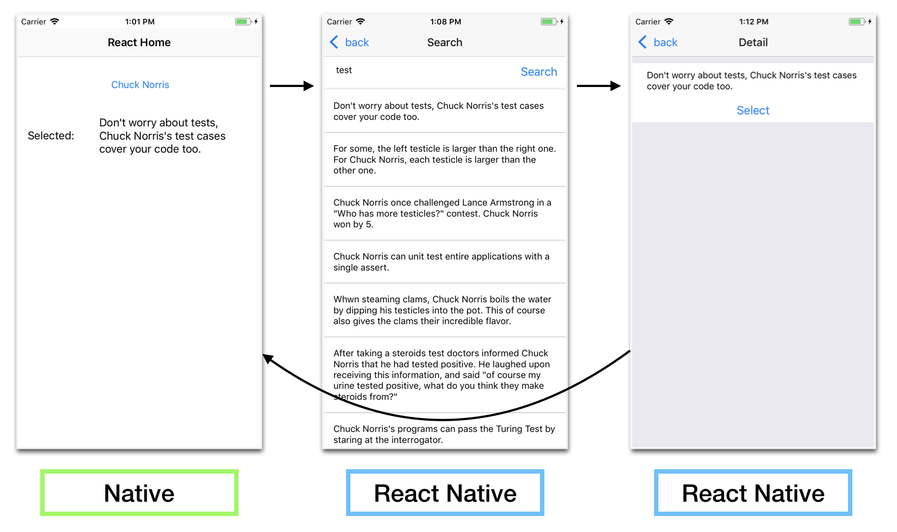

# React Native Hybrid App

- A sample implementation of React Native - Native Hybrid application using ReactNative + Redux + RxJs
- This application opens React Native screen from Native platform, fetch a list of Chuck Norris Fact on React Native, and return selected value to Native platform.  

### Android

### iOS

# Note
### Android
- master branch is a very basic implementation of the hybrid application on Android.
- If you would like to see a real world code, switch a branch to 'react_service_architecture'. This branch showcases a practical hybrid application using Dagger2 for DI and RxJava2 for creating Observer Pattern.  　

### iOS
- master branch is a very basic implementation of the hybrid application on iOS.
- You might want to use RxSwift or other Reactive programming library to implement Observer Pattern.

# Setup and run

### React Native
- install dependencies by either `npm install` or `yarn install`
- Start React Native Server by `react-native start`

### Android
- Open Android Studio from `android/build.gradle`, and start the application from "Run" button

### iOS
- Run `pod install` beforehand and install libraries required for React Native
- Open `ios2/chuckNorrisViewer2.xcworkspace`
- Build and start the app
